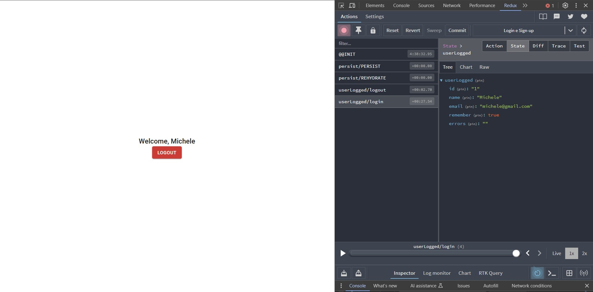

# Redux e MUI - Páginas de Login e Sign-Up

Este documento descreve o desenvolvimento das páginas de Login e Sign-Up de uma aplicação em React, utilizando Material-UI para a interface e Redux com Redux-Persist para o gerenciamento de estado e persistência de dados.

## Funcionalidades

### Página de Sign-Up

A página de Sign-Up permite que novos usuários se registrem na aplicação. Para garantir uma boa experiência e segurança, os seguintes campos são obrigatórios:

**Endereço de Email:** O usuário deve fornecer um e-mail válido.

- O e-mail deve conter o caractere @.
- O domínio do e-mail deve ser válido (ex.: Gmail, Hotmail, Outlook).
- Deve ter pelo menos 3 caracteres antes do @.

**Senha:**

- A senha deve conter mais de 4 caracteres.
- A senha não pode ser uma sequência de números consecutivos (ex.: 1123456).
- Confirmação de Senha: O usuário deve confirmar a senha para garantir que ambas sejam idênticas.

**Validações Adicionais**

**1. E-mail:** Validação para garantir que o e-mail inserido seja no formato correto e tenha domínio permitido.

**2. Senha:** Verificação de comprimento e de caracteres sequenciais. A senha deve ser segura o suficiente para proteger os dados do usuário.

### Página de Login

A página de Login permite que os usuários façam login com as credenciais cadastradas durante o processo de Sign-Up. Após o login bem-sucedido, o usuário é redirecionado para a página Home.

**E-mail:** O usuário deve inserir o e-mail registrado durante o Sign-Up.

**Senha:** O usuário deve fornecer a senha cadastrada.

Ao realizar o login com sucesso, o usuário será redirecionado para a Home. Caso o usuário não tenha uma conta, um link para a página de Sign-Up estará disponível.

### Função de Logout

Após o login, o usuário pode clicar no botão de Logout na página Home, o que acionará a função de logout, removendo os dados do usuário do estado global e redirecionando-o para a página de Login.

